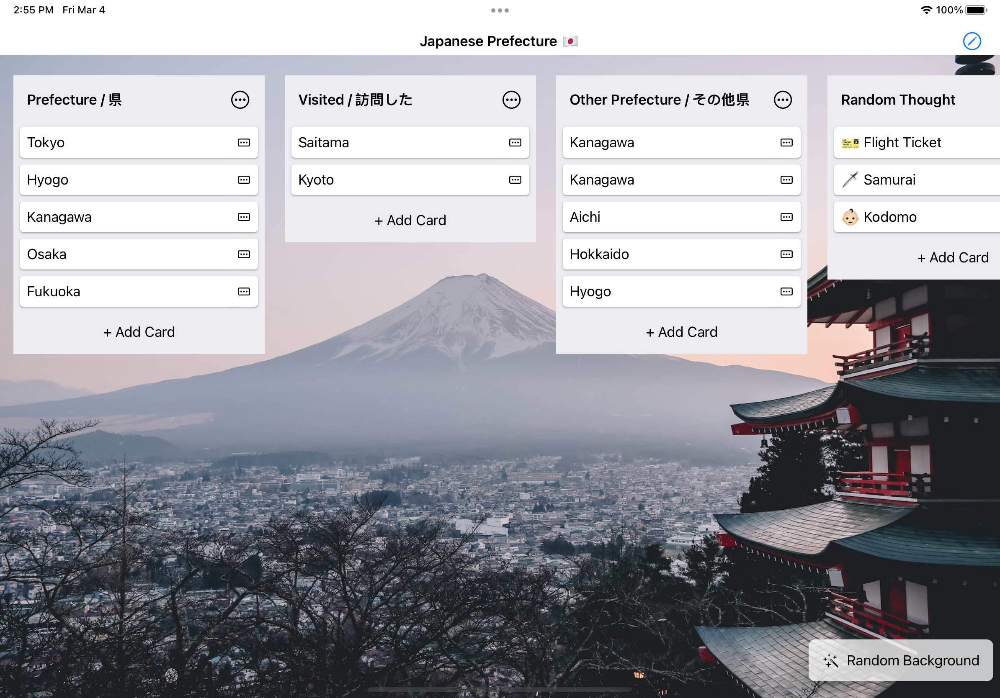
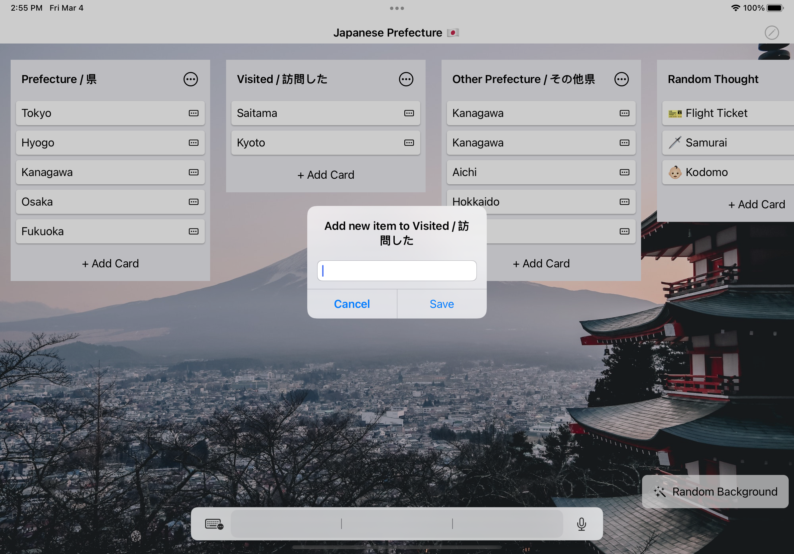
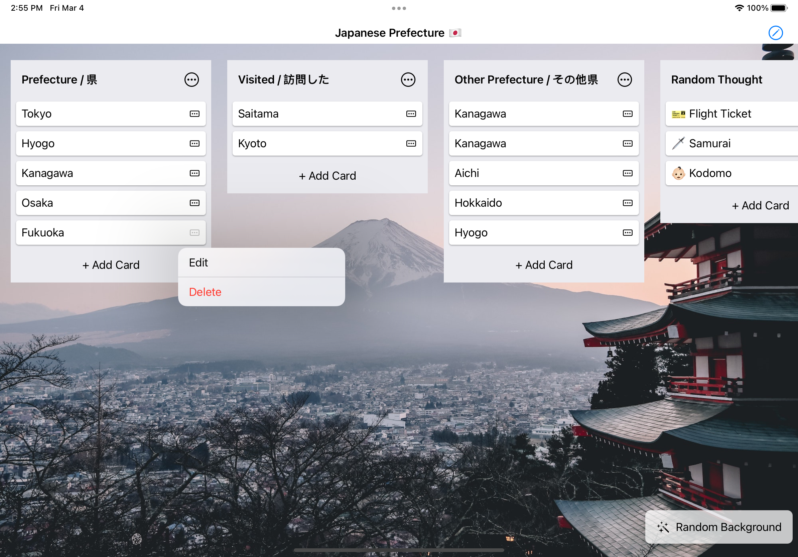

Xrello
===================


[](https://developer.apple.com/iphone/index.action)
[](https://developer.apple.com/swift)


An Trello app clone with SwiftUI
## 🏃‍♂️ Getting Started

``` bash
git clone https://github.com/robihamanto/xrello.git
cd Xrello
open Xrello.workspace # or xed .

- Run (⌘ + R)
```

## 👨🏻‍💻 Pesenin Design
  <p float="left">
    
     
     
  </p>
  <p float="left">
    
  </p>

Feature: 
- Add BoardList
- Add Item Card
- Reorder BoardList
- Reorder Item Card
- Move Card Between BoardList
- CRUD on CARD Item
- Change random image from Unsplash


## 🎉 Why I am building this?
1. Explore SwiftUI 🔥
2. Learn new thing


## 📱 Preview


<!--  -->
